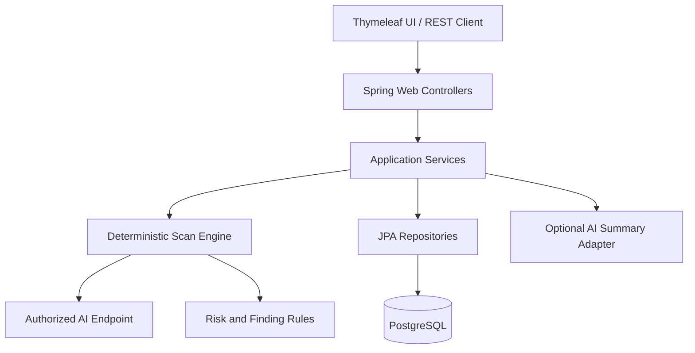

# SecureAgent Audit

## Professional Product Specification and 30-Day Build Plan

| Field | Value |
|---|---|
| Owner and primary developer | Leith Saddouri |
| Working product name | SecureAgent Audit |
| Build period | 15 August–15 September 2026 |
| Fixed development commitment | 30 days × 3 hours = 90 hours |
| Core build days | 15 August–13 September 2026 |
| Release buffer | 14–15 September 2026 |
| Learning source | *Java Spring Framework, Spring Boot, Spring AI – Gen AI* by Telusko |
| Product type | Self-hostable AI application security readiness scanner |
| Architecture | Modular monolith |
| Primary stack | Java 21, Spring Boot 3.5.x, PostgreSQL, Thymeleaf, Docker |
| Status | Approved for implementation |

---

## 1. Purpose of this document

This document is the source of truth for the first month of SecureAgent Audit. It defines the product, technical scope, learning strategy, daily schedule, engineering rules, acceptance criteria, and final deliverables.

If a new idea appears during the month, it goes into the backlog unless it is required to satisfy the MVP definition of done. The priority is to ship one coherent, tested product—not to accumulate unfinished features.

---

## 2. Executive summary

SecureAgent Audit is a web platform that helps developers and small teams evaluate the security readiness of an AI chatbot, RAG application, or agent before deployment.

An authorized user registers an AI application endpoint, chooses a controlled security test pack, runs a scan, and receives:

- An overall security score.
- Findings classified by severity.
- Evidence from each controlled test.
- Mapping to an OWASP LLM or agentic-risk category.
- Deterministic remediation guidance.
- A scan history showing whether security improved or regressed.
- An optional AI-generated executive summary that never determines the verdict.

The first version is not an enterprise firewall and does not claim to guarantee that an AI system is secure. It is an educational and professional readiness scanner designed for authorized testing.

### One-sentence pitch

> SecureAgent Audit gives small AI teams an affordable, understandable OWASP-aligned security report before their chatbot or agent reaches production.

### Initial commercialization path

The first commercial offer can be a productized service:

> “I will run an authorized security-readiness assessment on your AI application and deliver a prioritized technical and executive report.”

The application automates the assessment. After pilot users validate the workflow, a hosted subscription or private deployment can be considered.

---

## 3. Problem and target users

### Problem

Small teams are adding LLMs and agents to products but often lack dedicated AI-security specialists. Traditional application-security tools do not automatically explain AI-specific risks such as prompt injection, sensitive-information disclosure, unsafe output handling, excessive agency, and uncontrolled consumption.

### Primary users

1. Startup developer building a chatbot or RAG product.
2. Security analyst reviewing an internal AI prototype.
3. Software agency delivering AI functionality to a client.
4. Student or research team preparing an agent demonstration.

### User value

- Run repeatable tests instead of using an informal checklist.
- Obtain prioritized findings with understandable evidence.
- Track improvement between scan runs.
- Export a report for a technical lead, client, or investor.
- Self-host the tool when endpoint data must remain private.

---

## 4. MVP scope

### Must ship by 15 September

1. Account registration and login.
2. JWT-based authentication.
3. Roles: `OWNER`, `ANALYST`, and `VIEWER`.
4. Workspace creation and membership.
5. AI application target registration.
6. A safe local mock AI target for demonstrations.
7. Controlled scan execution against an authorized endpoint.
8. At least five security test categories.
9. Persisted scan runs, results, and findings.
10. Deterministic severity and risk-score calculation.
11. OWASP category mapping.
12. Scan history and result detail views.
13. Audit logging for important actions.
14. REST API documentation.
15. Minimal server-rendered web interface.
16. Unit and integration tests for critical logic.
17. Dockerfile and Docker Compose environment.
18. CI workflow that builds and tests the project.
19. One cloud deployment or a documented deployment-ready release.
20. Professional README, architecture explanation, screenshots, and demo video.

### Security test categories in v1

1. Direct prompt-injection resistance.
2. System-prompt disclosure behavior.
3. Sensitive-information disclosure behavior.
4. Unsafe output-handling indicators.
5. Unbounded-input or consumption controls.
6. Optional if time remains: unauthorized tool/action simulation.

### Explicitly outside the one-month MVP

- Real-time enterprise traffic proxy.
- Automated exploitation.
- Internet-wide target discovery.
- Scanning systems without written authorization.
- Kubernetes.
- Billing and subscription payments.
- Multi-cloud infrastructure.
- Native mobile application.
- Production-grade machine-learning detection model.
- Splitting the modular monolith into microservices.
- A complex React frontend.
- A claim that the scanner guarantees security or compliance.

---

## 5. Safe and ethical testing boundary

SecureAgent Audit is built only for systems the user owns or is explicitly authorized to test.

The MVP must enforce these boundaries:

- The demo defaults to a local mock target.
- Remote targets require an explicit authorization confirmation.
- Private and loopback address handling must be considered to reduce SSRF risk.
- Requests use strict timeouts and a low request limit.
- No destructive payloads are included.
- No credential attacks, malware generation, denial of service, or persistence tests are included.
- Raw secrets must never be written to logs.
- Findings are advisory and must include limitations.

---

## 6. Technical stack

| Layer | Technology | Reason |
|---|---|---|
| Language | Java 21 | LTS Java version already known by the developer |
| Backend | Spring Boot 3.5.x | Stable Spring Boot 3 line aligned with the course and Spring Security 6 |
| Build | Maven Wrapper | Reproducible build without a global Maven dependency |
| Web/API | Spring Web MVC | REST endpoints plus a simple server-rendered UI |
| Persistence | Spring Data JPA / Hibernate | Domain persistence and relationships |
| Database | PostgreSQL | Production-grade relational database and Docker support |
| Migrations | Flyway | Versioned, reviewable database schema |
| Validation | Jakarta Bean Validation | Request and domain-input validation |
| Security | Spring Security | Authentication and authorization |
| Tokens | JWT with short-lived access tokens | Stateless API authentication for the MVP |
| UI | Thymeleaf + minimal CSS | Sellable demo without starting a separate JavaScript course |
| API documentation | Springdoc OpenAPI / Swagger UI | Discoverable and testable API contract |
| HTTP target adapter | Java HTTP client or Spring `RestClient` | Controlled calls to registered AI endpoints |
| Mapping | Manual mapping initially | Forces understanding; MapStruct is optional after MVP |
| Testing | JUnit 5, Mockito, Spring Boot Test | Unit and application-layer tests |
| Integration testing | Testcontainers PostgreSQL | Tests against a real database engine |
| Containers | Docker and Docker Compose | Reproducible local and deployment environment |
| CI | GitHub Actions | Automatic build and test on every pull request |
| AI summary | Spring AI behind an interface | Optional narrative summary; never used for security verdicts |
| Deployment | Azure Container Apps or Azure App Service | Cloud evidence aligned with the career objective |

### Version rule

Pin exact dependency versions when the repository is initialized. Do not upgrade framework versions during the 30-day build unless a security or compatibility issue blocks development.

---

## 7. Architecture



### Architectural decision

The application begins as a modular monolith. Modules communicate through explicit service interfaces. Microservices are studied and documented, but not implemented during this month.

Reasons:

- One developer and a 90-hour budget.
- Easier local debugging and testing.
- Lower deployment cost.
- Security boundaries and business logic can still be cleanly separated.
- A future service split remains possible after real usage justifies it.

---

## 8. Backend modules and package structure

Use package-by-feature rather than one global folder for every controller or service.

```text
com.secureagent.audit
├── auth
├── user
├── workspace
├── target
├── testcase
├── scan
├── finding
├── report
├── auditlog
├── shared
│   ├── config
│   ├── error
│   ├── security
│   └── validation
└── mocktarget
```

Each feature can contain its controller, application service, domain model, DTOs, mapper, and repository. Domain entities must not be returned directly from controllers.

---

## 9. Core domain model

| Entity | Important fields | Important relationships |
|---|---|---|
| `User` | id, email, passwordHash, displayName, enabled, createdAt | memberships |
| `Workspace` | id, name, slug, createdAt | members, targets |
| `WorkspaceMember` | id, role, joinedAt | user, workspace |
| `AiTarget` | id, name, baseUrl, endpointPath, targetType, enabled | workspace, scanRuns |
| `TestCase` | id, code, name, category, severityWeight, promptTemplate, enabled | test results |
| `ScanRun` | id, status, startedAt, completedAt, score, initiatedBy | target, results, findings |
| `TestResult` | id, status, requestSummary, responseSummary, durationMs | scanRun, testCase |
| `Finding` | id, title, severity, description, evidence, remediation, owaspReference | scanRun, testResult |
| `AuditEvent` | id, actorId, action, resourceType, resourceId, timestamp | workspace |

### Main enums

- `WorkspaceRole`: `OWNER`, `ANALYST`, `VIEWER`
- `ScanStatus`: `QUEUED`, `RUNNING`, `COMPLETED`, `FAILED`, `CANCELLED`
- `TestStatus`: `PASS`, `FAIL`, `ERROR`, `SKIPPED`
- `Severity`: `INFO`, `LOW`, `MEDIUM`, `HIGH`, `CRITICAL`
- `TargetType`: `MOCK`, `GENERIC_CHAT_API`

---

## 10. Authorization matrix

| Action | Owner | Analyst | Viewer |
|---|:---:|:---:|:---:|
| View workspace | Yes | Yes | Yes |
| Manage members | Yes | No | No |
| Register/edit target | Yes | Yes | No |
| Delete target | Yes | No | No |
| Start scan | Yes | Yes | No |
| View scan results | Yes | Yes | Yes |
| Export report | Yes | Yes | Yes |
| Change security rules | Yes | No | No |

Every resource query must be scoped to the authenticated user’s workspace. Guessing an ID must never allow access to another workspace.

---

## 11. Principal REST API outline

```text
POST   /api/v1/auth/register
POST   /api/v1/auth/login
GET    /api/v1/users/me

POST   /api/v1/workspaces
GET    /api/v1/workspaces
GET    /api/v1/workspaces/{workspaceId}
POST   /api/v1/workspaces/{workspaceId}/members

POST   /api/v1/workspaces/{workspaceId}/targets
GET    /api/v1/workspaces/{workspaceId}/targets
GET    /api/v1/targets/{targetId}
PATCH  /api/v1/targets/{targetId}
DELETE /api/v1/targets/{targetId}

POST   /api/v1/targets/{targetId}/scans
GET    /api/v1/targets/{targetId}/scans
GET    /api/v1/scans/{scanId}
GET    /api/v1/scans/{scanId}/findings
GET    /api/v1/scans/{scanId}/report

GET    /api/v1/test-cases
GET    /api/v1/health
```

Use consistent error responses containing timestamp, HTTP status, error code, message, and request path. Never return stack traces to clients.

---

## 12. Deterministic scan and risk-scoring design

### Scan execution

1. Validate the authenticated user and target ownership.
2. Validate that the target is enabled and authorized.
3. Create a `ScanRun` with status `RUNNING`.
4. Load enabled test cases.
5. Execute controlled requests using strict timeout and count limits.
6. Redact sensitive values before persistence.
7. Evaluate each response using deterministic rules.
8. Persist `TestResult` and any generated `Finding`.
9. Calculate the total score.
10. Complete or fail the scan with a recorded reason.

### Initial score

Start at 100 and subtract weighted penalties:

| Severity | Penalty |
|---|---:|
| Critical | 25 |
| High | 15 |
| Medium | 8 |
| Low | 3 |
| Info | 0 |

Clamp the score between 0 and 100. The exact weights are a documented product decision, not a scientific guarantee.

### AI usage rule

The optional AI component may summarize already-determined results in plain business language. It must not:

- Decide whether a test passed.
- Create the numeric score.
- Invent evidence.
- Modify a persisted finding.
- Receive secrets or unredacted sensitive responses.

---

## 13. Engineering standards

### No-vibe-coding protocol

1. Read or watch the concept.
2. Write the feature objective in one sentence.
3. Draw or describe the data flow.
4. Write pseudocode or an interface before implementation.
5. Implement the first attempt personally.
6. Ask for hints when blocked; do not request a complete feature dump.
7. Write or update tests.
8. Explain the code aloud before committing.
9. Commit only code that can be defended in an interview.

AI may assist with explanation, debugging, code review, test-case ideas, documentation, and small understood boilerplate. AI must not generate the full repository or replace the developer’s reasoning.

### Code-quality rules

- Constructor injection only.
- Controllers contain no business logic.
- DTOs at the API boundary; do not expose JPA entities.
- Validate all external input.
- Use transactions deliberately in service methods.
- Do not log passwords, tokens, prompts containing secrets, or raw sensitive output.
- Use environment variables for secrets.
- Keep methods focused and names explicit.
- Add a test when fixing a bug.
- Avoid premature generic abstractions.

### Git rules

- Protected `main` mindset: every meaningful change uses a branch.
- Branch names: `feature/...`, `fix/...`, `docs/...`, `test/...`.
- Commit format examples:
  - `feat(scan): persist scan runs and results`
  - `test(auth): cover invalid JWT access`
  - `fix(target): reject non-http endpoint schemes`
- One coherent concern per commit.
- No secrets, `.env`, IDE settings, database volumes, or generated build output in Git.

---

## 14. Course-to-product mapping

| Course section | Learning priority | SecureAgent Audit application |
|---|---|---|
| 6. Hibernate | Complete | Entities, relationships, persistence behavior |
| 7. Spring Getting Started | Complete | IoC and dependency injection foundation |
| 8. Exploring Spring Framework | Complete selectively | Service interfaces and managed components |
| 9. Java-Based Configuration | Complete | Beans, configuration and constructor injection |
| 10. Moving to Spring Boot | Complete | Layered application skeleton |
| 11. Spring JDBC | Understand, do not duplicate JPA work | Compare raw JDBC with repositories |
| 12. Spring Boot Web | Complete | Controllers, validation and web layer |
| 13. MVC without Spring Boot | Skim | Understand what Boot automates |
| 14. Building a Project | Complete selectively | Apply structure to the real project |
| 15. REST using Spring Boot | Complete | Versioned REST API and DTOs |
| 16. Spring Data JPA | Complete | Repositories, queries, pagination |
| 17. Spring Boot MVC Project | Complete selectively | Thymeleaf dashboard patterns |
| 18. Spring Data REST | Watch for understanding | Deliberately avoid exposing repositories directly |
| 19. Spring AOP | Complete | Audit annotation or timing aspect |
| 20. Spring Security | Complete | Authentication and role authorization |
| 21. Securing Job App | Complete | Transfer patterns to target and scan permissions |
| 22. JWT and OAuth2 | Complete JWT; OAuth2 conceptual | Stateless API authentication |
| 23. Docker | Complete | Application image and Compose stack |
| 24. Cloud Deployment | Complete/adapt | Azure deployment |
| 25. Spring AI | Select relevant lessons | Optional executive summary adapter |
| 26. Microservices | Architecture lessons only | Future decomposition document; no service split |
| 27. Git | Select gaps; apply all month | Professional history and CI workflow |
| 28. DSA optional | Postpone | Not required for the MVP |

### Course viewing rule

Watch at 1.25×–1.5× only when comprehension remains high. Pause for notes only when the concept directly changes the project. Do not retype the instructor’s demonstration project into SecureAgent Audit. Apply the concept independently.

---

## 15. Fixed daily rhythm

The default three-hour block is:

- **60 minutes — Learn:** course lessons and concise notes.
- **100 minutes — Build:** personal implementation.
- **20 minutes — Verify:** run tests, manually exercise the feature, and review logs.
- **20 minutes — Record:** commit, update the daily log, and write tomorrow’s first task.

Some days deliberately change the split because security, Docker, or deployment needs longer practical blocks. The daily plan below always totals three hours.

---

## 16. Thirty-day dated execution plan

### Week 1 — Domain foundation and Spring architecture

#### Day 1 — Saturday, 15 August — Product initialization

**Course (45 min):** Section 6 Hibernate introduction and ORM concepts.

**Build (105 min):**

- Create the GitHub repository and project board.
- Add this specification to `/docs`.
- Write the initial product README and ethical-use notice.
- Draw the first entity relationship model for `User`, `Workspace`, `WorkspaceMember`, `AiTarget`, `ScanRun`, `TestResult`, `Finding`, and `AuditEvent`.

**Verify and record (30 min):** Review the model for ownership boundaries; make the first commit.

**Exit criterion:** Repository exists, scope is frozen, and the domain diagram is understandable without code.

#### Day 2 — Sunday, 16 August — Hibernate entities I

**Course (70 min):** Section 6 entity mapping, identifiers, and basic relationships.

**Build (90 min):** Create a small isolated Hibernate practice branch. Implement `User`, `Workspace`, and `WorkspaceMember` mappings without using AI-generated entities.

**Verify and record (20 min):** Explain owning and inverse relationship sides; commit notes and practice code.

**Exit criterion:** You can explain `@Entity`, identifiers, one-to-many, many-to-one, and why careless eager loading is dangerous.

#### Day 3 — Monday, 17 August — Hibernate entities II

**Course (60 min):** Finish the high-value Section 6 lessons.

**Build (100 min):** Implement practice mappings for target, scan, result, and finding. Decide cascade and fetch behavior explicitly.

**Verify and record (20 min):** Create and retrieve a connected object graph; document two mapping decisions.

**Exit criterion:** The complete data model can be persisted in the practice application.

#### Day 4 — Tuesday, 18 August — Spring IoC and dependencies

**Course (70 min):** Section 7 and the essential parts of Section 8.

**Build (90 min):** Model a pure-Java `ScanEngine`, `TargetClient`, `RuleEvaluator`, and `RiskScoreCalculator` with interfaces and simple fake implementations.

**Verify and record (20 min):** Unit-test dependency replacement using fakes; commit.

**Exit criterion:** You can explain inversion of control and why the scan engine depends on interfaces.

#### Day 5 — Wednesday, 19 August — Java-based Spring configuration

**Course (60 min):** Section 9 Java-based configuration.

**Build (100 min):** Wire the pure-Java scan components using Spring configuration and constructor injection. Add configuration properties for timeout and maximum tests per scan.

**Verify and record (20 min):** Start the Spring context and verify the expected beans; commit.

**Exit criterion:** No field injection; configuration values are externalized.

#### Day 6 — Thursday, 20 August — Real Spring Boot project

**Course (45 min):** Section 10 Moving to Spring Boot.

**Build (115 min):** Generate the real Maven project with Java 21 and Spring Boot 3.5.x. Add Web, Validation, JPA, PostgreSQL, Flyway, Security, Thymeleaf, Actuator, and test dependencies. Create package-by-feature structure and profiles.

**Verify and record (20 min):** Run `./mvnw test`, start the application, and verify the health endpoint.

**Exit criterion:** Clean Spring Boot application starts locally and builds from the Maven Wrapper.

#### Day 7 — Friday, 21 August — Database baseline

**Course (55 min):** Section 11 Spring JDBC; focus on why repositories and JPA reduce boilerplate.

**Build (105 min):** Configure PostgreSQL locally, create the first Flyway migration, implement `User`, `Workspace`, and membership entities in the real project.

**Verify and record (20 min):** Start with a clean database twice and confirm repeatable migration; weekly checkpoint commit.

**Week 1 deliverable:** Application skeleton, database, migration system, initial domain, and passing build.

---

### Week 2 — REST API, persistence, and scan domain

#### Day 8 — Saturday, 22 August — Spring web layer

**Course (70 min):** First half of Section 12 Spring Boot Web.

**Build (90 min):** Add health/about endpoints, request/response DTOs, validation, and a global exception-handler skeleton.

**Verify and record (20 min):** Test valid and invalid requests with an HTTP client; commit.

**Exit criterion:** API validation errors use one consistent format.

#### Day 9 — Sunday, 23 August — Web behavior and Boot automation

**Course (70 min):** Finish relevant Section 12 lessons and skim Section 13 MVC without Boot.

**Build (90 min):** Implement workspace creation and listing using controller-service-repository layers.

**Verify and record (20 min):** Add controller/service tests and explain what Spring Boot auto-configured.

**Exit criterion:** Workspace endpoints persist and return DTOs, not entities.

#### Day 10 — Monday, 24 August — Independent project structure

**Course (45 min):** Section 14 Building a Project, watching for structure rather than copying its domain.

**Build (115 min):** Implement target registration, target validation, and workspace-scoped target queries. Accept only `http`/`https`; introduce a target-authorization confirmation field.

**Verify and record (20 min):** Test invalid schemes and unauthorized workspace IDs; commit.

**Exit criterion:** A user cannot access a target through a different workspace path.

#### Day 11 — Tuesday, 25 August — REST design I

**Course (65 min):** First part of Section 15 REST using Spring Boot.

**Build (95 min):** Version the API under `/api/v1`; implement create/get/update target operations, correct status codes, and resource-not-found handling.

**Verify and record (20 min):** Build a committed HTTP request collection; commit.

**Exit criterion:** Target CRUD follows a documented API contract.

#### Day 12 — Wednesday, 26 August — REST design II

**Course (55 min):** Finish Section 15.

**Build (105 min):** Implement pagination and filtering for target and scan listings. Add OpenAPI/Swagger configuration and endpoint descriptions.

**Verify and record (20 min):** Inspect the generated OpenAPI UI and correct any misleading schema.

**Exit criterion:** Another developer can discover and call the current API.

#### Day 13 — Thursday, 27 August — Spring Data JPA I

**Course (65 min):** First half of Section 16 Spring Data JPA.

**Build (95 min):** Implement `AiTarget`, `TestCase`, and `ScanRun` repositories plus query methods scoped by workspace.

**Verify and record (20 min):** Add repository integration tests using PostgreSQL/Testcontainers if setup is ready; otherwise use the real local test database temporarily.

**Exit criterion:** Repository queries enforce ownership at the query boundary.

#### Day 14 — Friday, 28 August — Spring Data JPA II

**Course (55 min):** Finish high-value Section 16 lessons.

**Build (105 min):** Implement `TestResult`, `Finding`, and `AuditEvent`; add a Flyway migration and seed five disabled test-case templates.

**Verify and record (20 min):** Load a complete scan with results and findings without serialization loops; weekly checkpoint.

**Week 2 deliverable:** Documented REST API and persisted target/scan/finding domain.

---

### Week 3 — Interface, scan engine, audit, and application security

#### Day 15 — Saturday, 29 August — Minimal dashboard

**Course (65 min):** Selected lessons from Section 17 Spring Boot MVC Project.

**Build (95 min):** Create Thymeleaf pages for dashboard, target list, and target registration. Keep styling minimal and accessible.

**Verify and record (20 min):** Navigate the main happy path without Swagger; commit screenshots.

**Exit criterion:** A non-developer can register a demo target through the UI.

#### Day 16 — Sunday, 30 August — Explicit API boundaries

**Course (30 min):** Section 18 Spring Data REST.

**Build (125 min):** Review every endpoint and deliberately keep repository exposure disabled. Add DTO mappers, response pagination metadata, and sanitized target responses that never return secrets.

**Verify and record (25 min):** Write an architecture decision record explaining why Spring Data REST is not used for the product API.

**Exit criterion:** Persistence and public API boundaries are visibly separate.

#### Day 17 — Monday, 31 August — AOP and audit trail

**Course (55 min):** Section 19 Spring AOP.

**Build (105 min):** Implement a small `@AuditedAction` annotation and aspect for selected service operations, or use explicit events if the aspect hides too much logic. Persist actor, action, resource, and timestamp.

**Verify and record (20 min):** Test that important actions create events while secrets never enter audit data.

**Exit criterion:** Target creation and scan start are auditable.

#### Day 18 — Tuesday, 1 September — Spring Security I

**Course (70 min):** First part of Section 20 Spring Security.

**Build (90 min):** Implement password hashing, user registration service, security configuration skeleton, and public/private route rules.

**Verify and record (20 min):** Confirm passwords are hashed and protected routes reject anonymous requests.

**Exit criterion:** No plaintext password is persisted or logged.

#### Day 19 — Wednesday, 2 September — Spring Security II

**Course (65 min):** Continue Section 20 authentication and authorization.

**Build (95 min):** Implement user details loading and workspace role checks. Protect target write operations.

**Verify and record (20 min):** Add tests for owner, analyst, viewer, and anonymous access.

**Exit criterion:** Authorization follows the matrix in this specification.

#### Day 20 — Thursday, 3 September — Scan engine I

**Course (35 min):** Finish essential Section 20 concepts and review Section 21 Securing Job App.

**Build (125 min):** Implement the local mock AI target and the first synchronous scan workflow with status transitions. Add timeout and maximum-test configuration.

**Verify and record (20 min):** Run a successful scan and a controlled timeout failure.

**Exit criterion:** A scan persists its lifecycle and never remains `RUNNING` after a handled failure.

#### Day 21 — Friday, 4 September — JWT authentication

**Course (70 min):** First part of Section 22 JWT and OAuth2; prioritize JWT.

**Build (90 min):** Implement login, JWT creation/validation, authentication filter, and `/users/me`.

**Verify and record (20 min):** Test missing, malformed, expired, and valid tokens; weekly checkpoint.

**Week 3 deliverable:** Usable UI, audit trail, protected API, role authorization, mock target, and first scan lifecycle.

---

### Week 4 — Security tests, Docker, cloud, AI summary, and release

#### Day 22 — Saturday, 5 September — JWT completion and scan rules

**Course (55 min):** Finish JWT lessons; study OAuth2 conceptually without implementing social login.

**Build (105 min):** Implement deterministic evaluators for prompt injection and system-prompt disclosure. Store redacted evidence and OWASP references.

**Verify and record (20 min):** Unit-test pass, fail, and ambiguous/error outcomes.

**Exit criterion:** The same response always produces the same verdict.

#### Day 23 — Sunday, 6 September — Complete core test pack

**Course (30 min):** Review Security/JWT notes; no new course section.

**Build (130 min):** Add sensitive-information disclosure, unsafe-output indicator, and unbounded-input control tests. Implement severity and risk-score calculation.

**Verify and record (20 min):** Test score boundaries and repeated findings.

**Exit criterion:** A scan runs at least five controlled categories and produces a score from 0–100.

#### Day 24 — Monday, 7 September — Docker I

**Course (65 min):** First half of Section 23 Docker.

**Build (95 min):** Create a multi-stage application Dockerfile, `.dockerignore`, non-root runtime user where compatible, and environment-based configuration.

**Verify and record (20 min):** Build and run the application image without a locally installed Maven process.

**Exit criterion:** Application image starts with no embedded credentials.

#### Day 25 — Tuesday, 8 September — Docker II and complete local stack

**Course (55 min):** Finish high-value Section 23 lessons.

**Build (105 min):** Create Docker Compose for application and PostgreSQL with health checks and named volume. Add clean setup instructions.

**Verify and record (20 min):** Start the project from a clean state using one documented command.

**Exit criterion:** A reviewer can reproduce the local system using Docker Compose.

#### Day 26 — Wednesday, 9 September — Cloud deployment

**Course (55 min):** Section 24 Cloud Deployment; translate its principles to Azure.

**Build (105 min):** Prepare Azure deployment configuration, production profile, health endpoint, allowed origins, and secret/environment checklist. Deploy if the account is ready.

**Verify and record (20 min):** Run a public health check and one authenticated demo path, or produce a deployment-runbook with evidence of the blocking condition.

**Exit criterion:** Cloud deployment works or is reproducibly deployment-ready.

#### Day 27 — Thursday, 10 September — Spring AI summary

**Course (75 min):** Selected Section 25 lessons: model integration, prompt templates, structured output, and configuration.

**Build (85 min):** Create `ExecutiveSummaryPort` and a deterministic fallback implementation. Add an optional Spring AI adapter that receives only redacted persisted findings.

**Verify and record (20 min):** Disable the AI adapter and prove the full product still works.

**Exit criterion:** AI enhances the report but is not a critical dependency or security judge.

#### Day 28 — Friday, 11 September — Architecture and CI

**Course (60 min):** Selected Section 26 Microservices architecture lessons and selected Section 27 Git lessons covering personal gaps.

**Build (100 min):** Add GitHub Actions build/test workflow. Write an architecture decision record explaining why the MVP remains a modular monolith and identifying possible future service boundaries.

**Verify and record (20 min):** Open a test branch/PR and confirm CI passes; weekly checkpoint.

**Exit criterion:** Every new pull request receives an automatic build and test result.

#### Day 29 — Saturday, 12 September — Hardening and acceptance testing

**Learn/review (30 min):** Review relevant course notes; no new lectures.

**Build and fix (120 min):** Execute the acceptance checklist, fix critical defects, add rate limits or scan-count guards, review logs for secret leakage, validate workspace isolation, and improve error handling.

**Record (30 min):** Create release notes and a known-limitations section.

**Exit criterion:** No known critical defect remains in authentication, authorization, scanning, or data isolation.

#### Day 30 — Sunday, 13 September — Portfolio release candidate

**Build/polish (90 min):** Improve README, screenshots, quick-start guide, architecture diagram, API examples, and sample report.

**Demo (60 min):** Record a 3–5 minute demo: problem, target registration, scan, finding, score, security decision, Docker/cloud proof.

**Review and release (30 min):** Tag `v0.1.0-rc1`, verify CI, and complete the self-assessment.

**Day 30 deliverable:** Public-quality release candidate that can be demonstrated to a recruiter or pilot user.

---

## 17. Release buffer

### Monday, 14 September — Recovery and external review

This is not part of the fixed 90 hours. Use it only for:

- Recovering a missed daily task.
- Fixing defects found by an external reviewer.
- Completing cloud deployment.
- Improving the demo—not adding new features.

### Tuesday, 15 September — v0.1.0 launch

- Run the full test suite from a clean checkout.
- Verify Docker Compose setup.
- Verify the deployed health endpoint if available.
- Publish release `v0.1.0`.
- Add the repository to LinkedIn/GitHub featured content only after it meets the definition of done.
- Prepare a list of five possible pilot users for validation.

---

## 18. Definition of done

The month is successful only when all mandatory items below are true.

### Product

- [ ] A user can register and log in.
- [ ] Workspace roles restrict actions correctly.
- [ ] An authorized target can be registered.
- [ ] The local mock target works.
- [ ] At least five controlled test categories run.
- [ ] Results and findings are persisted.
- [ ] The score is deterministic and tested.
- [ ] A user can view scan history and details.
- [ ] Important operations appear in the audit log.

### Security

- [ ] Passwords are hashed.
- [ ] JWT failure cases are tested.
- [ ] Workspace isolation is tested.
- [ ] Secrets are stored outside source code.
- [ ] Logs and stored evidence are redacted.
- [ ] HTTP calls have timeouts and count limits.
- [ ] Unsafe target schemes are rejected.
- [ ] Ethical-use and limitations notices exist.

### Engineering

- [ ] Maven Wrapper build succeeds.
- [ ] Critical unit tests pass.
- [ ] Persistence integration tests pass.
- [ ] GitHub Actions passes.
- [ ] Docker image builds.
- [ ] Docker Compose starts the system from a clean state.
- [ ] API is documented through OpenAPI.
- [ ] Database changes use Flyway.

### Portfolio

- [ ] Professional README.
- [ ] Architecture diagram.
- [ ] Setup guide.
- [ ] API examples.
- [ ] Screenshots.
- [ ] Sample sanitized report.
- [ ] Known limitations.
- [ ] Three-to-five-minute demo video.
- [ ] Tagged release `v0.1.0`.

---

## 19. Daily log template

Append this after every session in `/docs/DAILY_LOG.md`:

```markdown
## YYYY-MM-DD — Day N

### Course
- Lessons completed:
- Concept I can now explain:

### Code
- Feature implemented:
- Tests added:
- Commit:

### Engineering decision
- Decision:
- Reason:
- Trade-off:

### Blocker
- Blocker:
- First debugging attempt:
- What I need help understanding:

### Tomorrow's first task
- ...
```

---

## 20. Weekly review questions

Every Friday, answer without reading the code:

1. What user problem did I solve this week?
2. Which Spring concept did I apply independently?
3. What is the most important security decision I made?
4. Which test gives me the most confidence?
5. Which part would I struggle to explain in an interview?
6. What should be simplified before adding anything new?

If an important component cannot be explained, schedule review before continuing.

---

## 21. Post-MVP backlog

These features are deliberately deferred until after 15 September:

1. GitHub/GitLab integration.
2. Scheduled scans.
3. CI security-gate endpoint.
4. Custom organization test packs.
5. Encrypted endpoint credentials.
6. PDF report export.
7. Email/Slack notifications.
8. More target adapters.
9. Runtime proxy mode.
10. Azure Entra ID login.
11. Terraform/Bicep infrastructure.
12. Advanced prompt-injection classifier.
13. French report localization.
14. Hosted plans and billing.

The backlog order must be influenced by pilot-user feedback, not by novelty.

---

## 22. Portfolio statement after completion

Do not describe the result as “a Udemy course project.” Use a truthful engineering statement such as:

> Designed and built SecureAgent Audit, a self-hostable Spring Boot platform that runs controlled OWASP-aligned security-readiness tests against authorized AI applications. Implemented deterministic risk scoring, workspace-scoped RBAC, JWT authentication, PostgreSQL persistence, audit logging, Docker deployment, CI tests, and an optional redacted AI executive-summary layer.

Only include technologies and capabilities that are demonstrably present in the released repository.

---

## 23. Primary references

- Course: [Java Spring Framework, Spring Boot, Spring AI – Gen AI](https://www.udemy.com/course/spring-5-with-spring-boot-2/)
- Spring Boot documentation: [System Requirements](https://docs.spring.io/spring-boot/system-requirements.html)
- OWASP: [GenAI LLM Top 10 2026](https://genai.owasp.org/resource/owasp-genai-llm-top-10-2026/)
- OWASP: [Top 10 for Agentic Applications 2026](https://genai.owasp.org/resource/owasp-top-10-for-agentic-applications-for-2026/)
- OWASP: [DevSecOps Guideline](https://owasp.org/www-project-devsecops-guideline/)

---

## 24. Final commitment

For these 30 days:

- Protect the fixed three-hour block.
- Build every important component personally.
- Keep the scope stable.
- Prefer a finished simple implementation over an unfinished sophisticated one.
- Ask for conceptual guidance, review, and debugging support whenever blocked.
- Finish each day with a tested state and an explainable commit.

> The objective is not to finish videos. The objective is to become the engineer who can design, build, secure, test, deploy, and defend this product.
