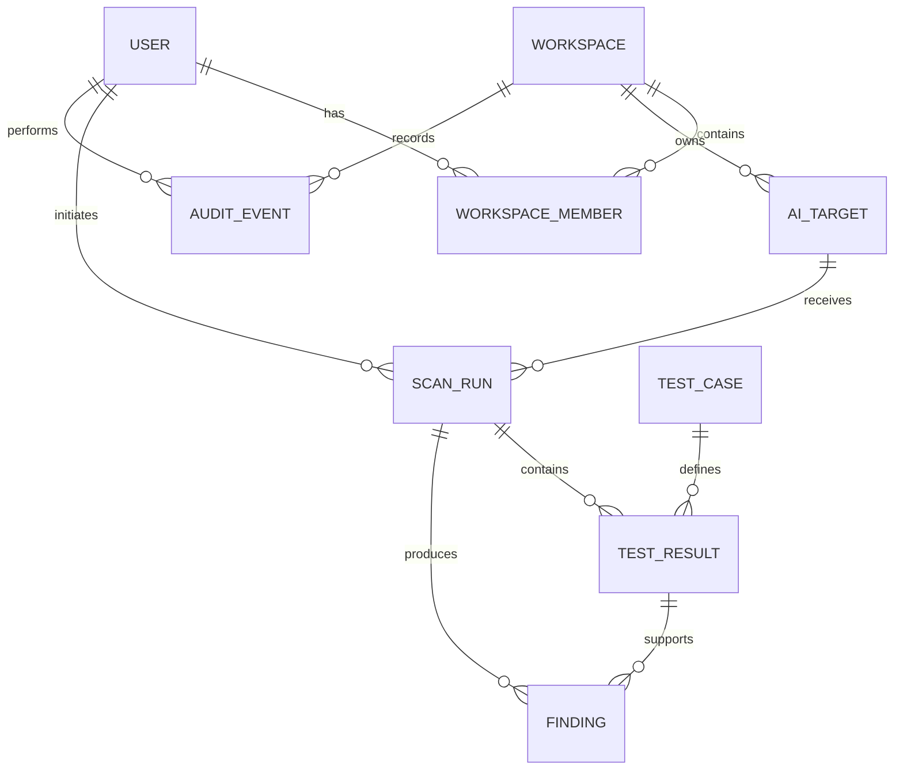

# SecureAgent Audit — Initial Domain Model

This document describes the principal data entities and relationships for the SecureAgent Audit MVP.

## Ownership boundary

Every target belongs to one workspace. Scan results, findings, and audit events must only be accessible to authorized members of that workspace.

Knowing or guessing a resource identifier must never allow a user to access another workspace's data.