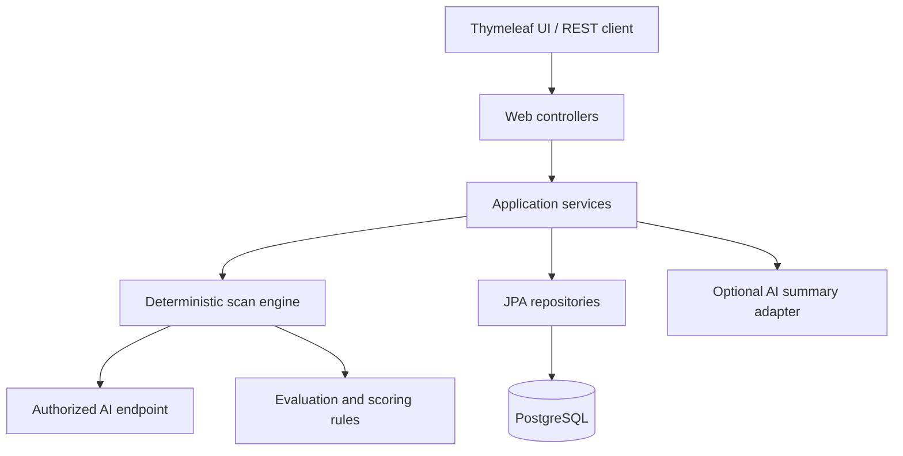

# SecureAgent Audit

> A self-hostable, OWASP-aligned security readiness scanner for authorized testing of AI chatbots, RAG applications, and agents.


## Overview

SecureAgent Audit helps developers and small teams assess the security readiness of an AI application before it reaches production. An authorized user registers an AI endpoint, selects a controlled test pack, runs a scan, and receives prioritized findings with evidence, severity, remediation guidance, and OWASP risk references.

The platform is designed to make AI security reviews repeatable and understandable without positioning itself as an enterprise firewall or a guarantee of security or compliance.

> [!IMPORTANT]
> SecureAgent Audit is currently under active development. The first public MVP, `v0.1.0`, is planned for **15 September 2026**. Capabilities marked as planned are not yet available in the repository.

## Why SecureAgent Audit?

Teams are rapidly adding LLMs and autonomous agents to products, but many do not have a dedicated AI security specialist. Traditional application-security tools may not clearly surface AI-specific risks such as prompt injection, system-prompt leakage, sensitive-information disclosure, unsafe output handling, excessive agency, and uncontrolled consumption.

SecureAgent Audit aims to provide:

- Repeatable security-readiness tests instead of an informal checklist.
- Deterministic verdicts and risk scoring.
- Understandable evidence and prioritized remediation guidance.
- OWASP-aligned risk mapping.
- Scan history to identify improvement or regression.
- Self-hosting when endpoint data must remain private.
- Optional AI-written summaries that never determine the security verdict.

## MVP capabilities

The `v0.1.0` release is planned to include:

- Account registration and JWT-based authentication.
- Workspace-scoped roles: `OWNER`, `ANALYST`, and `VIEWER`.
- Registration of authorized AI application endpoints.
- A safe local mock target for demonstrations.
- Controlled scan execution with strict request limits and timeouts.
- At least five deterministic AI security test categories.
- Findings classified from `INFO` through `CRITICAL`.
- Evidence redaction and deterministic risk scoring.
- OWASP LLM and agentic-risk references.
- Scan history, result details, and audit logging.
- A versioned REST API with OpenAPI documentation.
- A minimal server-rendered dashboard.
- PostgreSQL persistence with Flyway migrations.
- Docker Compose setup, automated tests, and CI.
- An optional redacted executive-summary adapter powered by Spring AI.

## Initial security test pack

| Category | What the scanner evaluates |
|---|---|
| Direct prompt injection | Whether a controlled instruction can override the target's intended behavior. |
| System-prompt disclosure | Whether the target reveals protected instructions or configuration details. |
| Sensitive-information disclosure | Whether responses expose secrets, personal data, or protected contextual information. |
| Unsafe output handling | Whether generated output contains indicators that downstream systems should treat as unsafe. |
| Unbounded consumption | Whether the target applies reasonable input, request, and resource controls. |
| Unauthorized tool or action simulation | Whether an agent attempts a sensitive action without sufficient authorization; planned if the MVP schedule permits. |

Every test uses controlled, non-destructive inputs. The same recorded response produces the same verdict.

## How it works

1. Create a workspace and register an AI application you are authorized to test.
2. Confirm authorization and select an enabled security test pack.
3. Run a bounded scan against the target endpoint.
4. Evaluate responses using deterministic security rules.
5. Redact sensitive values before storing evidence.
6. Calculate a score and persist findings with OWASP references.
7. Review technical findings, remediation guidance, and scan history.
8. Optionally generate a plain-language summary from already-determined, redacted results.

## Architecture

SecureAgent Audit starts as a modular monolith. This keeps the first release understandable, testable, and inexpensive to deploy while preserving explicit module boundaries for future growth.



### Package structure

The application follows a package-by-feature design:

```text
com.secureagent.audit
├── auth
├── user
├── workspace
├── target
├── testcase
├── scan
├── finding
├── report
├── auditlog
├── mocktarget
└── shared
    ├── config
    ├── error
    ├── security
    └── validation
```

Controllers expose DTOs rather than persistence entities, business logic remains in application services, and external target access is isolated behind an adapter interface.

## Technology stack

| Area | Technology |
|---|---|
| Language | Java 21 |
| Application | Spring Boot 3.5.x, Spring Web MVC |
| Security | Spring Security, JWT, password hashing, workspace-scoped RBAC |
| Persistence | Spring Data JPA, Hibernate, PostgreSQL, Flyway |
| Interface | Thymeleaf and minimal CSS |
| API documentation | Springdoc OpenAPI and Swagger UI |
| Testing | JUnit 5, Mockito, Spring Boot Test, Testcontainers |
| Infrastructure | Docker, Docker Compose, GitHub Actions |
| Optional AI layer | Spring AI behind an application interface |
| Deployment target | Azure Container Apps or Azure App Service |

## Deterministic risk scoring

Each scan starts at `100`. Confirmed findings subtract a documented penalty based on severity:

| Severity | Penalty |
|---|---:|
| Critical | 25 |
| High | 15 |
| Medium | 8 |
| Low | 3 |
| Info | 0 |

The final result is clamped between `0` and `100`. These weights are an explainable product decision, not a scientific guarantee or compliance certification.

AI is never used to pass or fail a test, calculate the numeric score, invent evidence, or modify a persisted finding.

## Getting started

The application bootstrap is scheduled during the first development week. Once available, the supported local workflow will be:

### Prerequisites

- Java 21
- Docker with Docker Compose
- Git

### Run with Docker Compose

```bash
git clone https://github.com/leithsaddouriesprit/secureagent-audit.git
cd secureagent-audit
docker compose up --build
```

### Run the test suite

```bash
./mvnw test
```

### Run the application locally

```bash
docker compose up -d postgres
./mvnw spring-boot:run
```

Configuration will be provided through environment variables. Secrets, tokens, and endpoint credentials must never be committed to source control.

> Replace `<your-username>` after the repository URL is finalized. Verified URLs, ports, environment variables, and demo credentials will be documented when the application skeleton is merged.

## Planned REST API

The API is versioned under `/api/v1`.

```text
POST   /api/v1/auth/register
POST   /api/v1/auth/login
GET    /api/v1/users/me

POST   /api/v1/workspaces
GET    /api/v1/workspaces
POST   /api/v1/workspaces/{workspaceId}/targets
GET    /api/v1/workspaces/{workspaceId}/targets

POST   /api/v1/targets/{targetId}/scans
GET    /api/v1/targets/{targetId}/scans
GET    /api/v1/scans/{scanId}
GET    /api/v1/scans/{scanId}/findings
GET    /api/v1/scans/{scanId}/report

GET    /api/v1/test-cases
GET    /api/v1/health
```

Swagger UI and the generated OpenAPI contract will become the authoritative API reference as endpoints are implemented.

## Security model

SecureAgent Audit is designed with the following controls:

- Workspace isolation at both the service and query boundaries.
- Role-based permissions for owners, analysts, and viewers.
- Password hashing and short-lived JWT access tokens.
- Explicit authorization confirmation for remote targets.
- Restriction to supported HTTP schemes and SSRF-aware target validation.
- Strict outbound-request timeouts and low request-count limits.
- Redaction before evidence persistence and AI summarization.
- Audit events for important user actions.
- Environment-based secret configuration.
- No stack traces or sensitive values in client errors and logs.

Security issues should not be disclosed in a public issue. Until a dedicated security contact is published, contact the repository owner privately with a concise reproduction and impact assessment.

## Ethical use

> [!WARNING]
> Use SecureAgent Audit only against systems you own or have explicit written authorization to test.

This project does not include destructive payloads, credential attacks, malware generation, denial-of-service tests, persistence mechanisms, or internet-wide target discovery. The default demonstration target is local. Remote scanning requires explicit authorization confirmation.

Users are responsible for obtaining permission and complying with applicable laws, contracts, and organizational policies. Findings are advisory and do not guarantee that a system is secure, compliant, or free from vulnerabilities.

## Development status and roadmap

| Milestone | Target | Status |
|---|---:|---|
| Repository, product scope, and domain design | 15 Aug 2026 | In progress |
| Application skeleton and database baseline | 21 Aug 2026 | Planned |
| REST API and persisted scan domain | 28 Aug 2026 | Planned |
| Authentication, authorization, UI, and scan lifecycle | 4 Sep 2026 | Planned |
| Core test pack, Docker, deployment, CI, and hardening | 13 Sep 2026 | Planned |
| Public MVP `v0.1.0` | 15 Sep 2026 | Planned |

Post-MVP priorities will be guided by pilot-user feedback and may include scheduled scans, CI security gates, custom test packs, encrypted endpoint credentials, PDF exports, notifications, more target adapters, and French report localization.

## Documentation

Project decisions and implementation evidence will live in `docs/`, including:

- Product specification and 30-day build plan.
- Architecture decision records.
- Daily engineering log.
- Deployment runbook.
- Sanitized sample security report.
- Known limitations and release notes.

## Contributing

The project is currently in a scope-frozen MVP phase. Focused bug reports, security-rule references, documentation corrections, and test ideas are welcome. Large feature proposals may be deferred until after `v0.1.0`.

Before opening a pull request:

1. Create a focused branch such as `feature/...`, `fix/...`, `docs/...`, or `test/...`.
2. Keep each commit limited to one coherent concern.
3. Add or update tests for behavior changes.
4. Run `./mvnw test` locally.
5. Never include secrets, raw sensitive model output, `.env` files, or generated build artifacts.

Recommended commit style:

```text
feat(scan): persist scan runs and results
test(auth): cover invalid JWT access
fix(target): reject unsupported endpoint schemes
```

## Project owner

**Leith Saddouri** — Owner and primary developer

SecureAgent Audit is being designed and built as an independent AI application-security engineering project.

## Acknowledgements

The project is informed by guidance from the [OWASP GenAI Security Project](https://genai.owasp.org/), including the OWASP Top 10 for LLM Applications and agentic application security resources.

SecureAgent Audit is an independent project and is not affiliated with or endorsed by OWASP.

---

<p align="center">
  <strong>Secure AI before it reaches production.</strong>
</p>
